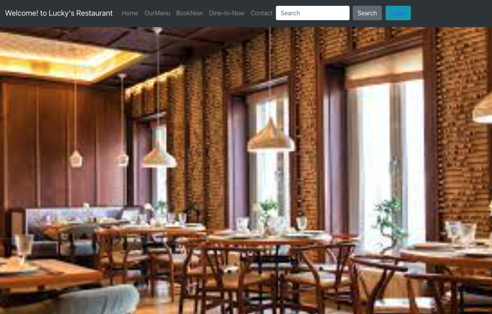
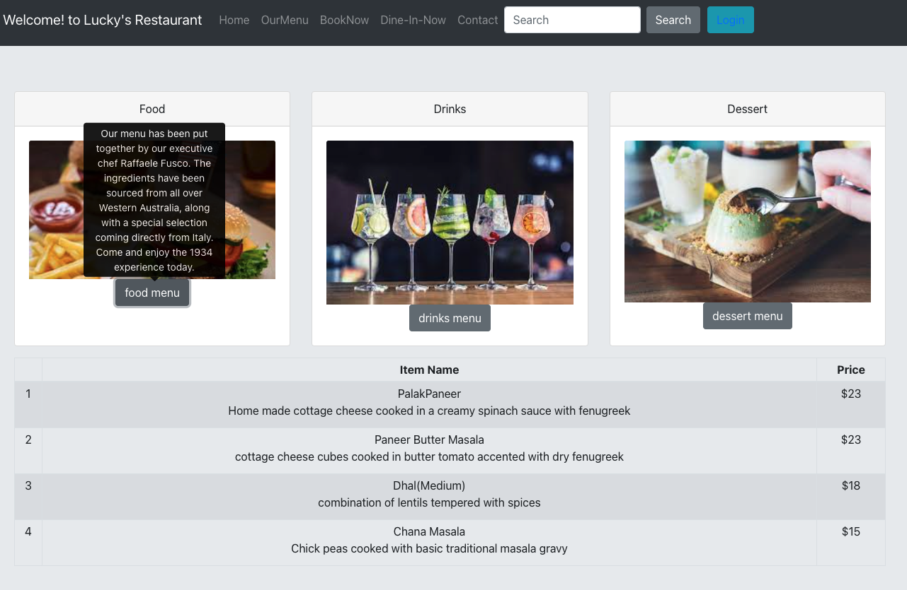
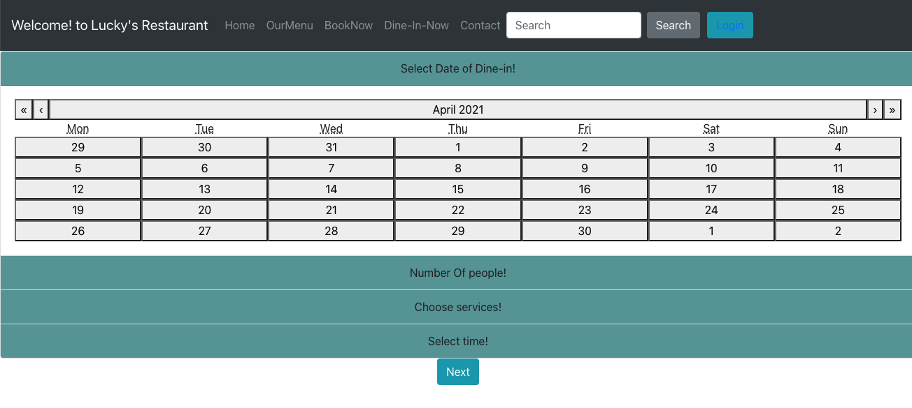
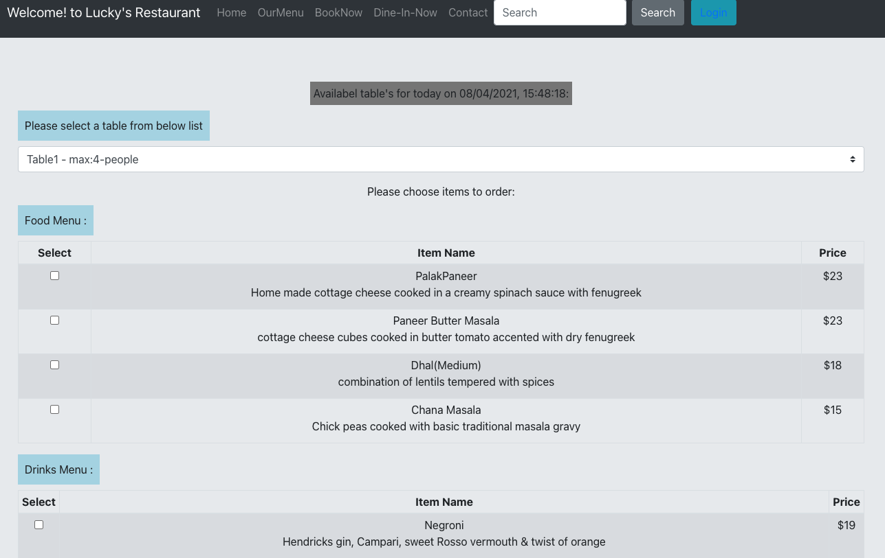

# React-Rails

### Technologies: React.JS, Rails and SQL.

## Project setup:  

Installation - clone this repo and open in VS code then open terminal

.....>cd client .....>npm install ......>npm start

 ......>cd server .....>bundle install....>rails server

 ## Project output:

.......>asks open your browser on http://localhost:3001/ Where u can see Restaurant page
..> Click on "Please Click on:Login" on the top for CRUD Operations
..> 

...> 

..> 

..> 